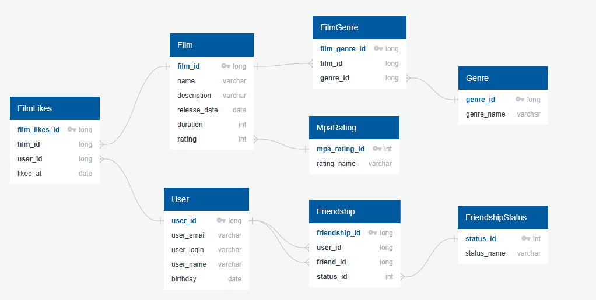

# java-filmorate
Template repository for Filmorate project.

# ER-диаграмма



## Примеры запросов

### Поиск самых популярных фильмов
```sql
SELECT f.name, COUNT(fl.user_id) AS count_likes
FROM Film f
LEFT JOIN FilmLikes fl ON f.film_id = fl.film_id
GROUP BY f.film_id
ORDER BY count_likes DESC
LIMIT 10;
```

### Поиск друзей пользователя
```sql
SELECT u.name, u.email
FROM User u
JOIN Friendship f ON u.user_id = f.friend_id
JOIN FriendshipStatus fs on f.status_id = fs.status_id
WHERE f.user_id = 1 AND fs.status_name = "CONFIRMED";
```
